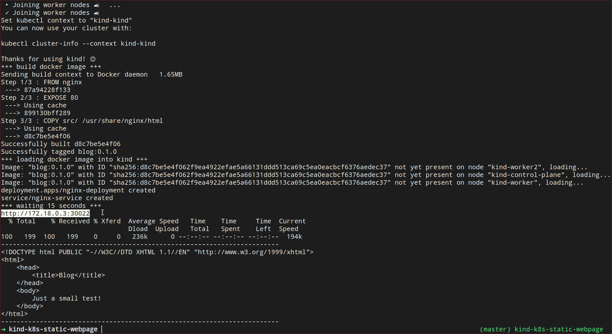

# Kubernetes in Docker (KinD)

This project compiles a local Docker container and then deploys it to the
kind cluster. Afterwards, the application and the service are deployed
in the KinD-k8s cluster.

## Prerequisites

The following components must be installed:

- docker
- kind
- kubectl

## Deploy

Start the deployment with

        deploy.sh

After the deloyment you can test your website with the given IP adress & port.

## Destroy cluster
Getting rid of a KinD cluster

        kind delete cluster

## kubectl

        kubectl get all -A

